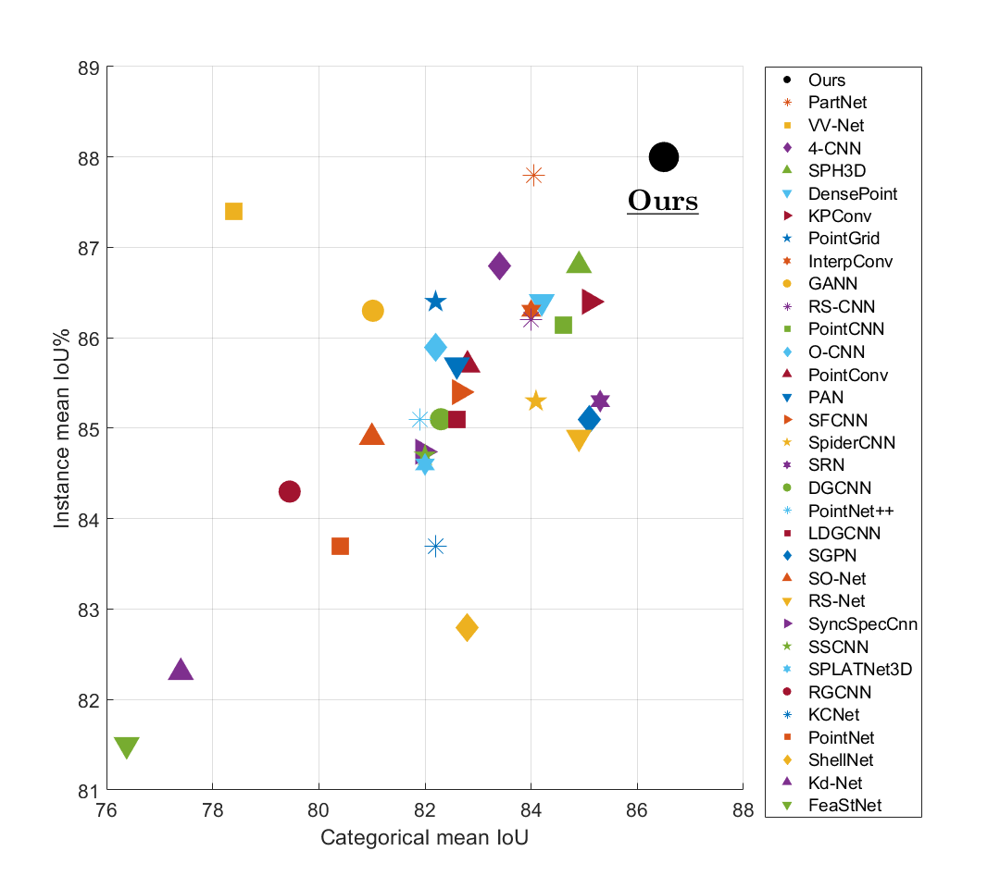
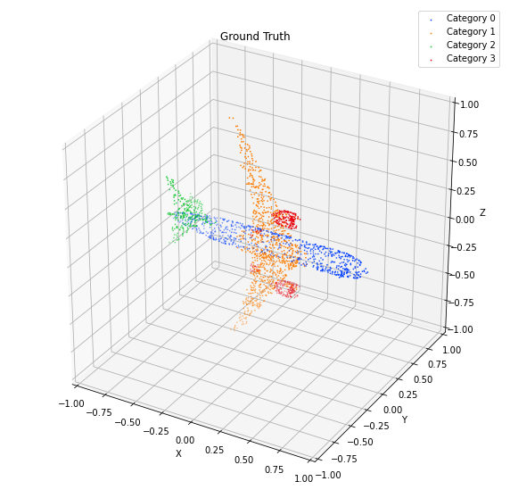
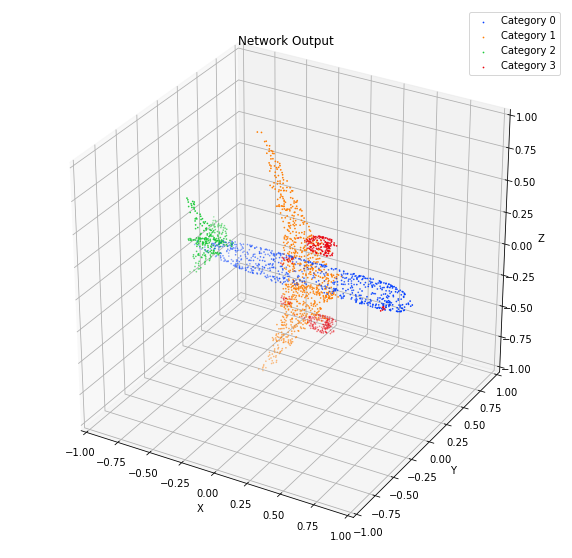

# Learning to Segment 3D Point Clouds in 2D Image Space

## Overview
In contrast to the literature where local patterns in 3D point clouds are captured by customized convolutional operators, in this paper we study the problem of how to effectively and efficiently project such point clouds into a 2D image space so that traditional 2D convolutional neural networks (CNNs) such as U-Net can be applied for segmentation. To this end, we are motivated by graph drawing and reformulate it as an integer programming problem to learn the topology-preserving graph-to-grid mapping for each individual point cloud. To accelerate the computation in practice, we further propose a novel hierarchical approximate algorithm. With the help of the Delaunay triangulation for graph construction from point clouds and a multi-scale U-Net for segmentation, we manage to demonstrate the state-of-the-art performance on ShapeNet and PartNet, respectively, with significant improvement over the literature.


Note1: We are terribly sorry that we missed our CVPR 2020 code submission. This repository is a reproduced work, and we released a pre-trained network model with 88.0% instance-mean-iou and 86.5% class-mean-iou. An updated ArXiv preprint is available [here](https://arxiv.org/abs/2003.05593).

##

## Conda environment setup
```
conda create -n XYZNet python=3.7
conda activate XYZNet
conda install --file requirements.txt
```

## Download the ShapeNet part segmentation dataset
```
sh S0_download_data.sh
```

## Prepare dataset: from 3D point clouds to 2D images
```
python S1_network_dataset_combination.py
python S1_network_dataset_preparation.py
```
This step took 22 hours on our machine. A prepared dataset is available [here](https://drive.google.com/file/d/1eFxzbP9V6RIZdOsxh236d1IYYWt61_7k/view?usp=sharing).

##  Training using prepared dataset

```
python S2_network_training
```
The training session took 200 hours. A pre-trained network model is available [here](https://drive.google.com/file/d/1XYdY51otNqsYt2hvy8xdJYuoD9kVhHxo/view?usp=sharing).

## Test the network
After training, we have got a well trained network models. To predict the semantic labels and evaluate on testing sets, run the following command:
```
python S3_network_testing
```
## Visualize the test results
```
python S4_visulization.py
```
By changing the *idx_class* in line 24, and *idx_class_sample* in line 25, we can visualize the result of any testing sample.


 


## Citation
```
@inproceedings{lyu2020learning,
  title={Learning to Segment 3D Point Clouds in 2D Image Space},
  author={Lyu, Yecheng and Huang, Xinming and Zhang, Ziming},
  booktitle={Proceedings of the IEEE/CVF Conference on Computer Vision and Pattern Recognition},
  pages={12255--12264},
  year={2020}
}
```
